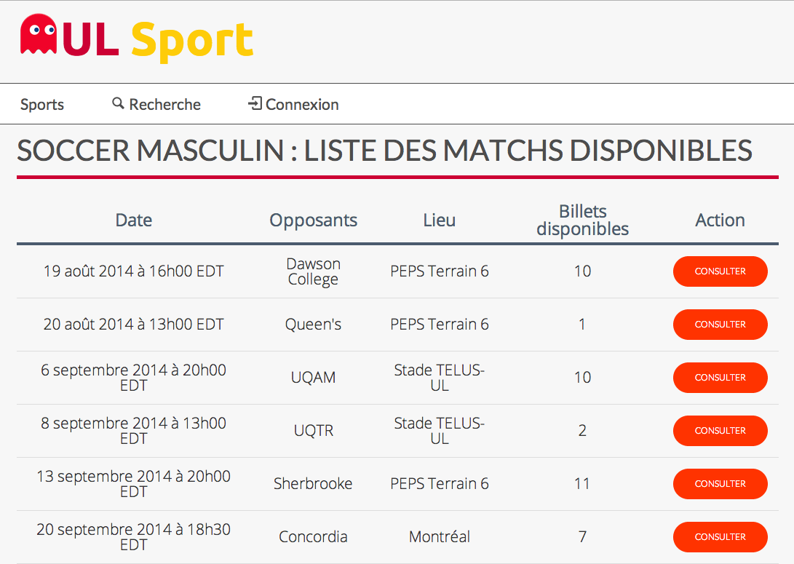

#Billetterie en ligne pour le Rouge et Or : projet de session en GLO 4003
##Description du projet
L'université Laval veut créer un système de billetterie en ligne pour la vente de billets pour ses matchs sportifs : soccer, football, basketball, rugby et volleyball. L'utilisateur peut rechercher des billets, acheter des billets et même revendre des billets. Une description un peu plus complète est présente dans le fichier de [description du projet](readme-files/presentation-projet.pdf).


sdfsdf
Le client, a créé *34 scénarios d'utilisation* (user storie) afin de décrire son projet. Ils sont présents dans le [fichier contenant la liste des scénarios](readme-files/scenarios-utilisation.pdf).

##Travail réalisé
Équipe **Bessice (B6)**, nous avons réalisé les scénarios ci-dessous.
La liste des critères d'acception de chaque scénario est présente en annexe dans un [fichier](readme-files/criteres-acceptation.pdf).

**Scénario 1 :** En tant qu'utilisateur, je peux créer un nouveau compte utilisateur afin de pouvoir acheter ou vendre des billets.
<br>
**Scénario 2 :** En tant qu'utilisateur, je peux me connecter à mon compte utilisateur afin de pouvoir acheter ou vendre des billets.
<br>
**Scénario 3 :** En tant qu'utilisateur, je peux visualiser la liste des matchs d'un sport afin de trouver une partie pour laquelle je veux acheter un billet.
<br>
**Scénario 4 :** En tant qu'utilisateur, je peux modifier mes critères de recherche à tout moment afin de trouver le billet que je désire.
<br>
**Scénario 5 :** En tant qu'utilisateur, je veux que le système m'affiche si des billets sont disponibles pour une partie à laquelle je veux assister dans le but d'acheter d'éventuels billets disponibles.
<br>
**Scénario 6 :** En tant qu'utilisateur, je peux sélectionner un billet afin de voir ses informations (Date,heure,match,équipe, catégories du billet, etc.) dans le but de savoir si ce billet m'intéresse.
<br>
**Scénario 7 :** En tant qu'usager, je dois pouvoir acheter un billet sélectionné afin de pouvoir assister à un match.
<br>
**Scénario 9 :** En tant qu'usager, je veux pouvoir posséder un panier d'achat afin d'acheter plusieurs billets en une même connexion.
<br>
**Scénario 12 :** En tant qu'usager, je peux sélectionner un billet à acheter afin de procéder à l'étape de paiement.
<br>
**Scénario 16 :** Sans intervention extérieure, le système doit enregistrer tout achat et toute vente.
<br>
**Scénario 17 :** En tant qu'usager, je veux pouvoir indiquer et sauvegarder mes préférences de billets au système afin d'accélérer mes recherches présentes et futures.
<br>
**Scénario 25 :** En tant qu'usager, je dois m'identifier avant d'accéder à mon compte afin de pouvoir prendre les actions qui sont sous ma responsabilité (et seulement ces actions).
<br>
**Scénario 26 :** En tant qu'administrateur, je dois pouvoir ajouter de nouveaux billets dans le système afin de pouvoir vendre ceux-ci.
<br>
**Scénario 34 :** En tant qu'usager, je peux acheter tous les billets de mon panier d'achats en une seule transaction.
<br>
**Scénario 35 :** En tant qu’administrateur, je peux ajouter un match au calendrier d’un sport afin de pouvoir rendre des billets disponibles pour ce match.

Pour une meilleur compréhension du système, le [rapport 2](readme-files/rapport2.pdf) est disponible.



##Installation
###Prérequis
Afin de pouvoir installer et exécuter le projet, il est nécessaire d’installer Git et Maven sur le poste de travail.

###Clonage et exécution
Les commandes suivantes sont à entrer dans un Terminal afin de cloner et d’exécuter le projet :
```
git clone -b remise_finale https://github.com/Archi2013/ulaval-sports-tickets.git
cd ulaval-sports-tickets/
mvn jetty:run
```

Enfin, ouvrir un navigateur web et aller à l’adresse :[http://localhost:8080](http://localhost:8080) .

###Utilisation
Voir la section idoine dans le [rapport 2](readme-files/rapport2.pdf).

##Équipe
Marc-Olivier Alain <marc-olivier.alain.1@ulaval.ca>  
Pierre-Olivier Bédard <pierre-olivier.bedard.3@ulaval.ca> <pobed2@gmail.com>  
Mathieu	Béland-Lachance <mathieu.beland-lachance.1@ulaval.ca>   
Carl Bélanger <carl.belanger.2@ulaval.ca>  
Mathieu Charest-Durand <mathieu.charest-durand.1@ulaval.ca>  
Mathieu	Nivelles [mathieunivelles.com](http://mathieunivelles.com) <mathieu.nivelles.1@ulaval.ca>  
Dominique Pothier <dominique.pothier.1@ulaval.ca>   

<!--[Documents d'architecture](https://drive.google.com/folderview?id=0B6L1IrGcf14raUk5LURGVnNyTlk&usp=sharing)-->
